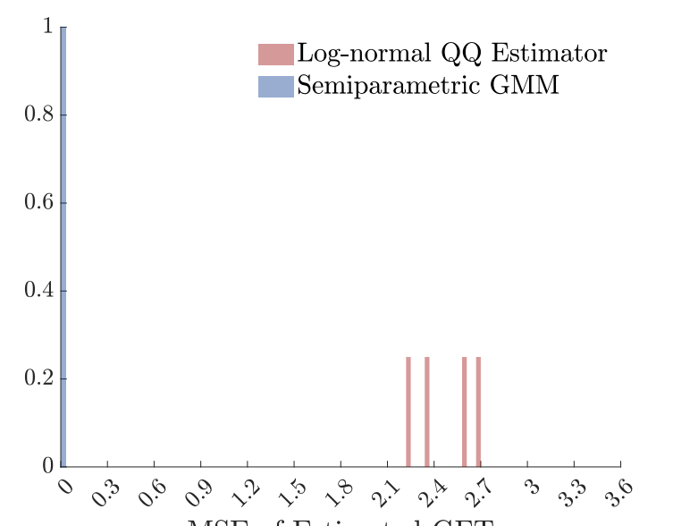
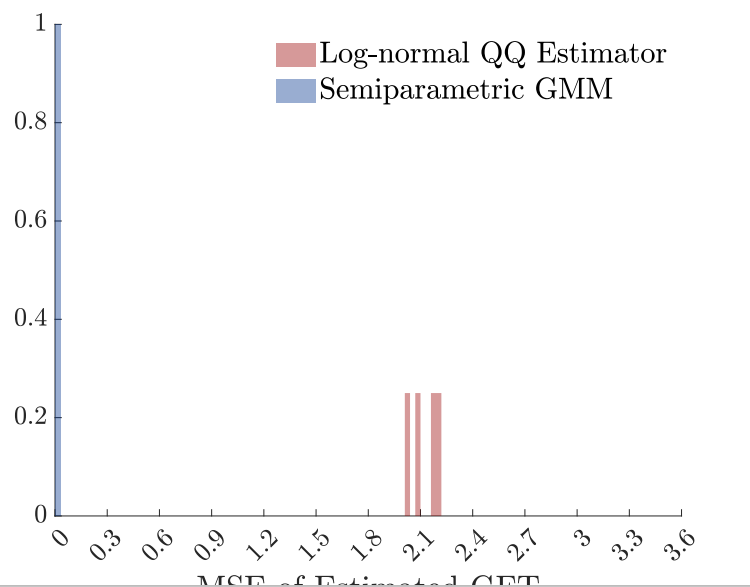
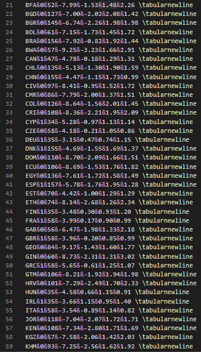
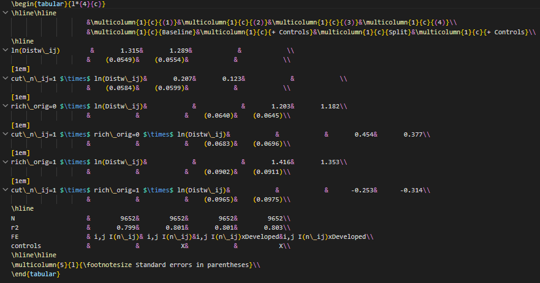
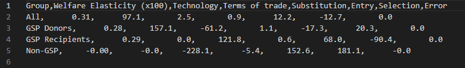

# Paper Identification

|  |   |
| ---  |  -------|
| ID  |   |
| Author  |   |
| Title  |   |
| Iteration |   |

Some useful information up front:

- [JPE Data and Code Availability Policy](https://www.journals.uchicago.edu/journals/jpe/datapolicy)
- [Step by step guidance from Data Editor for Authors](https://jpedataeditor.github.io/) 
- [Template README](https://social-science-data-editors.github.io/template_README/)

# Summary

In assessing compliance with our [Data and Code Availability Policy](https://www.journals.uchicago.edu/journals/jpe/datapolicy), our reproducibility team has identified the following issues, which we ask you to address:

# General

- [X] Data Availability and Provenance Statements
  - [X] Statement about Rights - Part 1: Right to use the data (e.g. *did the authors lawfully obtain the data*)
  - [X] Statement about Rights - Part 2: Right to publish the data (e.g. *are human subjects involved and did permission been granted to publish their data?*)
  - [ ] License for Data (optional, but recommended)
  - [X] Details on each Data Source
- [X] Dataset list
- [X] Computational requirements
  - [X] Software Requirements
  - [X] Controlled Randomness (as necessary)
  - [X] Memory, Runtime, and Storage Requirements
- [X] Description of programs/code
  - [ ] License for Code (Optional, but recommended) 
- [x] {REPLICATOR} to Replicators
  - [ ] Details (as necessary)
- [X] List of tables and programs
- [X] References (Optional, but recommended) 

 **Comment**: Once again my compliments on the README, the document improved even further and is very detailed and has all the necessary information. 
 
# High-level Description of Research Project

*This research project...*

- [X] uses observational data.
- [X] uses *confidential* observational data.
- [ ] uses data generated via experiment or trial by the authors (in field or lab).
  - [ ] For lab experiments: The code to implement the experimental protocol (z-Tree, o-Tree etc) is included in the package.
  - [ ] A PDF copy of IRB approval is contained in the package.
  - [ ] A PDF document outlining the design of the experiment, including information on the selection and eligibility of participants is included.
  - [ ] A PDF copy of the instructions given to participants in both original language and an English translation is included.
- [ ] uses data generated via survey by the authors (in field or online)
  - [ ] The programs used to administer the survey (e.g. qualtrics survey file) are included.
  - [ ] A PDF copy of IRB approval is contained in the package.
  - [ ] A PDF of the original questionaire(s) and information on the selection and eligibility of participants is included.
- [ ] is a simulation study: the data are generated by an algorithm.
- [ ] is a numerical illustration: no data are used but code is used to produce illustrative output (tables, figures)

# Data description

## Data Sources

| Data Source / file name                     | public | private | DOI/URL | Access described | cited in README | cited in paper |
|---------------------------------------------|--------|---------|---------|------------------|------------------|----------------|
| UNCTAD TRAINS – Tariff Data                 | no     | no      | yes     | yes              | yes              | yes            |
| World Bank EDD – Exporter Dynamics Database | yes    | no      | yes     | yes              | yes              | yes            |
| World Bank EDD – Colombian Microdata        | no     | yes     | no      | yes              | yes              | yes            |
| CEPII – Gravity Variables                   | yes    | no      | yes     | yes              | yes              | yes            |
| WIOD – World Input-Output Database (2016)   | yes    | no      | yes     | yes              | yes              | yes            |
| Teti Tariffs – Feodora Teti Data            | yes    | no      | yes     | yes              | yes              | yes            |
| OECD SDBS/TEC – Firm Demographics & TEC     | yes    | no      | yes     | yes              | yes              | yes            |
| US Census – Manufacturer Enterprises (2012) | yes    | no      | yes     | yes              | yes              | yes            |
| Australia Data – Characteristics of Exporters| yes   | no      | yes     | yes              | yes              | yes            |
| China Statistical Yearbook (2019)           | yes    | no      | yes     | yes              | yes              | yes            |
| China Export Data                           | no     | yes     | no      | yes              | yes              | yes            |
| World Bank Enterprise Surveys               | yes    | no      | yes     | yes              | yes              | yes            |
| GSP Rates – Constructed from TRAINS         | no     | no      | no      | yes              | yes              | yes            |
| Eora MRIO – Multi‑Region Input‑Output Data  | yes    | no      | yes     | yes              | yes              | yes            |

# Requirements 

- [X] README is in TXT, MD, or PDF format
- [X] README is accessible at the root of the package (not inside a folder)
- [x] Title conforms to guidance (starts with "Data and Code for: Title of Paper" or "Code for: Title of Paper", is properly capitalized)
- [X] Authors (with affiliations) are listed in the same order as on the paper

## Stated Requirements

- [ ] No requirements specified
- [X] Software Requirements specified as follows:
  - Stata 16.1/MP
  - Matlab 2023a
- [x] Computational Requirements specified as follows:
  - These programs were run on an OS X environment (M2 processor with 16 cores and 32 GB RAM) and a 1 TB SSD.
  - `Master_script_gravity_v3.m`: Requires approximately 32 GB RAM. The sectoral (HS2-level) robustness estimations are the most memory-intensive stage. With less memory, MATLAB may crash partway through the robustness specifications.
  - `LinearCF_wrapper_v3.m` and `GFT_script_v17.m`: Require approximately 16 GB RAM each.
  - `run_mc_master.m`: Designed for a cluster environment. Was run on an external Linux cluster with 100 available cores (32 GB addressable each). To run on a single workstation, reduce `sims` (default 100) and set `cores` to match available resources in `run_mc_master.m`. For example, `sims = 10; cores = 4` will complete in a few hours on a 32 GB machine, though Monte Carlo results will be noisier.
  
- [x] Time Requirements specified as follows:
  - 8-24 hours

- [X] Requirements are complete.

# Analyzing Data and Code Files











## Code description

- There are eight Stata do-files, six Matlab master .m files and one master do-file (Stata and Matlab combined).



- [X] The replication package contains a "main" or "master" file(s) which calls all other auxiliary programs.

> NOTE: In-text numbers that reference numbers in tables do not need to be listed. Only in-text numbers that correspond to no table or figure need to be listed.

The table below provides an overview of all intermediate and final datasets generated throughout the replication. This information is provided in the README. 

| Dataset | Description | Generated By | Used By |
|---------|-------------|--------------|---------|
| `[YEAR]_Tetiuw.csv` | Baseline gravity sample (bilateral trade, tariffs from Teti, gravity controls) | `p04_Sample_Creation.do` | `Master_script_gravity_v3.m`, `GFT_script_v17.m`, `LinearCF_wrapper_v3.m` |
| `[YEAR]_Tuw.csv` | Alternative gravity sample (tariffs from TRAINS) | `p04_Sample_Creation.do` | `Master_script_gravity_v3.m` |
| `[YEAR]_TuwIV2.csv` | IV specification sample | `p04_Sample_Creation.do` | `Master_script_gravity_v3.m` |
| `n_ij_[YEAR]B.csv` | Bilateral number of exporters matrix (C×C) | `p04_Sample_Creation.do` | `GFT_script_v17.m`, `LinearCF_wrapper_v3.m` |
| `x_ij_[YEAR]B.csv` | Bilateral average export size matrix (C×C) | `p04_Sample_Creation.do` | `GFT_script_v17.m` |
| `XX_ij_[YEAR]B.csv` | Bilateral total exports matrix (C×C) | `p04_Sample_Creation.do` | `GFT_script_v17.m`, `LinearCF_wrapper_v3.m` |
| `balance_i_[YEAR]B.csv` | Country-level aggregates (expenditure, production, trade balance) | `p04_Sample_Creation.do` | `GFT_script_v17.m` |
| `G_ij_[YEAR]B.csv` | Bilateral group classification (developed/developing origin) | `p04_Sample_Creation.do` | `GFT_script_v17.m`, `LinearCF_wrapper_v3.m` |
| `G4_ij_[YEAR]B.csv` | Four-way group classification | `p04_Sample_Creation.do` | `GFT_script_v17.m` |
| `Sample_[YEAR]B.csv` | Sample selection indicators | `p04_Sample_Creation.do` | `GFT_script_v17.m`, `LinearCF_wrapper_v3.m` |
| `l_i_[YEAR]B.csv` | Country labels | `p04_Sample_Creation.do` | `GFT_script_v17.m` |
| `N_ii_[YEAR]B.csv` | Domestic firm counts | `p04_Sample_Creation.do` | `LinearCF_wrapper_v3.m` |
| `GSP_delta_[YEAR]B.csv` | GSP tariff reduction indicators | `p04_Sample_Creation.do` | `LinearCF_wrapper_v3.m` |
| `GSP_[YEAR]B.csv` | GSP eligibility indicators | `p04_Sample_Creation.do` | `LinearCF_wrapper_v3.m` |
| `mfn_rate_[YEAR]B.csv` | MFN tariff rates | `p04_Sample_Creation.do` | `LinearCF_wrapper_v3.m` |
| `[YEAR]_survival_.csv` | Firm survival rates (1-year) | `p04_Sample_Creation.do` | `Master_script_gravity_v3.m` |
| `[YEAR]_survival_all_.csv` | Firm survival rates (all) | `p04_Sample_Creation.do` | `Master_script_gravity_v3.m` |
| `[YEAR]_survival_alt3_.csv` | Firm survival rates (3-year) | `p04_Sample_Creation.do` | `Master_script_gravity_v3.m` |
| `[YEAR]_nonii_.csv` | Sample dropping imputed domestic firms | `p04_Sample_Creation.do` | `Master_script_gravity_v3.m` |
| `Data/Int/stack_data_B.dta` | Stacked panel dataset (all years, bilateral pairs with tariffs and gravity) | `p04_Sample_Creation.do` | `p06_ReducedForm.do` |
| `Data/Int/CEPII_Grav_temp.dta` | Cleaned CEPII gravity variables | `p04_Sample_Creation.do` | `p05_Sample_Creation_HS2.do` |
| `Data/Int/CEPII_rich.dta` | Developed/developing country classification | `p04_Sample_Creation.do` | `p05_Sample_Creation_HS2.do` |
| `Output/[YEAR]_Sample_summary.tex` | Estimation sample summary statistics | `p04_Sample_Creation.do` | Paper Table OA.2 |
| `Output/Hist_[YEAR]B.pdf` | Histogram of exporter firm shares | `p04_Sample_Creation.do` | Paper Figure OA.6 |
| `gamma_gravity.mat` | Estimated gravity coefficients | `Master_script_gravity_v3.m` | `GFT_script_v17.m`, `LinearCF_wrapper_v3.m` |
| `ESTIMATES_LINEAR.mat` | Linear counterfactual estimation objects | `LinearCF_wrapper_v3.m` | `Graphs_TC.m`, `Graphs_GSP.m` |
| `ESTIMATES_SPLINE2.mat` | Spline (2 knots) counterfactual estimation objects | `LinearCF_wrapper_v3.m` | `Graphs_TC.m`, `Graphs_GSP.m` |
| `ESTIMATES_SPLINE4.mat` | Spline (4 knots) counterfactual estimation objects | `LinearCF_wrapper_v3.m` | `Graphs_TC.m`, `Graphs_GSP.m` |
| `ESTIMATES_SPLINE6.mat` | Spline (6 knots) counterfactual estimation objects | `LinearCF_wrapper_v3.m` | `Graphs_TC.m`, `Graphs_GSP.m` |
| `Output/Decomposition_Results_TC[scenario].csv` | Welfare decomposition results (tariff cut scenarios) | `Graphs_TC.m` | Paper Table 1 |
| `Output/Decomposition_Results_GSP[scenario].csv` | Welfare decomposition results (GSP scenarios) | `Graphs_GSP.m` | Paper Table OA.6 |
| `GFT_results_revision_2012B.xlsx` | Welfare decomposition results (GFT analysis) | `GFT_script_v17.m` | Paper Figure 5 |
| `Simulated_data_[spec]_alt.mat` | Simulated economies (LogNormal, MPareto, MEstimates) | `solve_FP.m` | `Script_GMM_simulation.m`, `Script_QQ_simulation.m` |
| `Simulated_[spec]_Estimates_[basis]_[knots]_alt.mat` | GMM simulation estimates | `Script_GMM_simulation.m` | `figures_gen.m` |
| `Simulated_[spec]_Estimates_QQLogNormal_1_[force_n]_alt.mat` | QQ simulation estimates | `Script_QQ_simulation.m` | `figures_gen.m` |

## Computing Environment of the Replicator

- Nuvolos 16vCPU 64GB RAM

- Stata/MP 16.0
- Matlab R2023a

# Replication

## Stata

- Downloaded code and data from dropbox.
- unzipped all the necessary datafiles. 
- Ran the master do-file as per README, in Stata. Earlier problems are now solved, the code ran smoothly and without any errors. 

## Matlab

- Downloaded code and data from dropbox.
- unzipped all the necessary datafiles. 
- Ran the scripts per README. Most of the scripts ran fine and without any error. 

`Master_script_gravity_v3.m`: The same issue as in the previous round, the code generates some output but breaks down at a certain point. As the authors mention in the README this is probably caused due to the lack of RAM. However, the README states that this script needs approximately 32GB RAM and my Nuvolos system for Matlab has a total of 64GB. So this set-up should've been able to run this code, but still breaks down. I was therefore not able to generate figures OA.13, OA.14, OA.15, OA.16. 

# Findings {#sec-findings}

## Missing Requirements

- [ ] Software Requirements 

  

> [REQUIRED] Please amend README to contain complete requirements. 

You can copy the section above, amended if necessary.

## Data Preparation Code

- Code/p01_TRAINS_clean_data_v1_AAG.do ran without any error. 
- Code/p02_quantiles_colombia_firmexports.do ran without any error. 
- Code/p02_eora_trade_matrix_clean.do ran without any error. 
- Code/p02_ChinaData_Morrow.do ran without any error.
- Code/p03_Create_Tariffs.do ran without any error. 
- Code/p04_Sample_Creation.do ran without any error.
- Code/p05_Sample_Creation_HS2.do ran without any error. 
- Code/p06_ReducedForm.do ran without any error.
- Code/GMM_estimation_v3/Master_script_gravity_v3.m breaks down due to limited RAM. 
- Code/GFT_v2/GFT_script_v17.m ran without any error.
- Code/LinearCF_v3/LinearCF_wrapper_v3.m ran without any error.
- Code/ColombiaTests/Quantiles_Colombia_Wrapper.m ran without any error.
Code/MonteCarlo/run_mc_master.m ran without error but with only 10 sims and only 16 cores. 
- Code/LogCorrected/plots.m ran without any error.
- Code/Appendix_LogCorrected/AppendixFigure_LogPareto.m ran without any error.

## Tables and Figures

| Figure/Table # | Program | Reproduced? |
|----------------|---------|-------------|
| Figure 1       | Matlab  | Yes         |
| Figure 2       | Matlab  | Yes     |
| Figure 3       | Matlab  | Yes         |
| Figure 4       | Matlab  | Yes         |
| Figure 5       | Matlab  | Yes         |
| Figure 6       | Matlab  | Yes          |
| Table 1        | Matlab  | Yes          |
| Figure OA.1    | Matlab  | Yes         |
| Figure OA.2    | Matlab  | Yes         |
| Figure OA.3    | Matlab  | No     |
| Figure OA.4    | Matlab  | Yes     |
| Figure OA.5    | Matlab  | Yes     |
| Figure OA.6    | Stata   | Yes         |
| Table OA.1     | -       | N/A         |
| Table OA.2     | Stata   | No          |
| Table OA.3     | -       | N/A         |
| Figure OA.7    | Matlab  | Yes         |
| Figure OA.8    | Matlab  | Yes         |
| Figure OA.9    | Matlab  | Yes         |
| Figure OA.10   | Matlab  | Yes         |
| Figure OA.11   | Matlab  | Yes         |
| Figure OA.12   | Matlab  | Yes         |
| Figure OA.13   | Matlab  | No          |
| Figure OA.14   | Matlab  | No          |
| Figure OA.15   | Matlab  | No          |
| Figure OA.16   | Matlab  | No          |
| Figure OA.17   | Matlab  | Yes         |
| Figure OA.18   | Matlab  | Yes         |
| Figure OA.19   | Matlab  | Yes         |
| Figure OA.20   | Matlab  | Yes         |
| Figure OA.21   | Matlab  | Yes         |
| Figure OA.22   | Matlab  | Yes         |
| Figure OA.23   | Matlab  | Yes         |
| Figure OA.24   | Matlab  | Yes         |
| Figure OA.25   | Matlab  | Yes         |
| Figure OA.26   | Matlab  | Yes         |
| Figure OA.27   | Matlab  | Yes         |
| Figure OA.28   | Matlab  | Yes         |
| Figure OA.29   | Matlab  | Yes          |
| Figure OA.30   | Matlab  | Yes          |
| Figure OA.31   | Matlab  | Yes          |
| Figure OA.32   | Matlab  | Yes         |
| Figure OA.33   | Matlab  | Yes         |
| Table OA.4     | Stata   | No          |
| Table OA.5     | Matlab  | Yes         |
| Table OA.6     | Matlab  | No          |

- Figures OA.13, OA.14, OA.15, OA.16 were not generated by the corresponding code (`Master_script_gravity_v3.m`). Therefore, these outputs can't be verified in this replication round. 

- The tables below were generated by the corresponding code but showed discrepancies in their output compared to the tables in the paper. See the explanations and screenshots for further details.

- Figure OA.3: Figure a & c are completely different. However, this is most likely caused by the lower number of sims (10 instead of 100) and cores (16 instead of 100) in the Monte Carlo script. 

  

- Table OA.2: The tables are identical except for the number of destinations, where BFA (53 vs 52), CMR (87 vs 86), and KEN (112 vs 108). Same discrepancies as last round. 

- Table OA.4: A lot of discrepancies in the generated output, same as last round. 

- Table OA.6: Few discrepancies in the coefficients: 61,2 vs 61,3 & 121,8 vs 120,6. 

## Other Issues

README improved even further and the authors solved several issues in the code. I am not able to generate output from a few scripts, this is most likely caused due to limited computational capacity. However, I would like another look at the `Master_script_gravity_v3.m` script, as my Matlab setup with 64GB RAM should be able to run this (according to the README). Still a few discrepancies in the output, majority of the output matches. 

# Classification

- [ ] full reproduction
- [ ] full reproduction with minor issues
- [x] partial reproduction (see above)
- [ ] not able to reproduce most or all of the results (reasons see above)

## Reason for incomplete reproducibility

- [ ] None.
- [x] `Discrepancy in output` (either figures or numbers in tables or text differ)
- [ ] `Bugs in code` that were fixable by the replicator (but should be fixed in the final deposit)
- [ ] `Code missing`, in particular if it prevented the replicator from completing the reproducibility check
  - [ ] `Data preparation code missing` should be checked if the code missing seems to be data preparation code
- [ ] `Code not functional` is more severe than a simple bug: it prevented the replicator from completing the reproducibility check
- [ ] `Software not available to replicator` may happen for a variety of reasons, but in particular (a) when the software is commercial, and the replicator does not have access to a licensed copy, or (b) the software is open-source, but a specific version required to conduct the reproducibility check is not available.
- [ ] `Insufficient time available to replicator` is applicable when (a) running the code would take weeks or more (b) running the code might take less time if sufficient compute resources were to be brought to bear, but no such resources can be accessed in a timely fashion (c) the replication package is very complex, and following all (manual and scripted) steps would take too long.
- [ ] `Data missing` is marked when data *should* be available, but was erroneously not provided, or is not accessible via the procedures described in the replication package
- [ ] `Data not available` is marked when data requires additional access steps, for instance purchase or application procedure. 
- [ ] `Missing README` is marked if there is no README to guide the replicator, or the README is not in compliance with JPE requirements