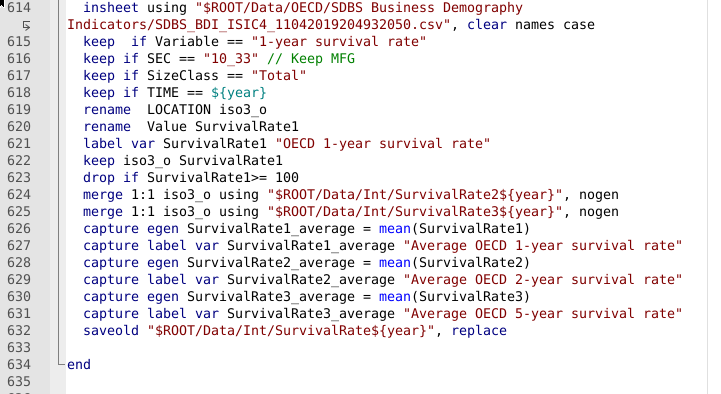

# Paper Identification

|  |   |
| ---  |  -------|
| ID  |   |
| Author  |   |
| Title  |   |
| Iteration |   |

Some useful information up front:

- [JPE Data and Code Availability Policy](https://www.journals.uchicago.edu/journals/jpe/datapolicy)
- [Step by step guidance from Data Editor for Authors](https://jpedataeditor.github.io/) 
- [Template README](https://social-science-data-editors.github.io/template_README/)

# Summary

In assessing compliance with our [Data and Code Availability Policy](https://www.journals.uchicago.edu/journals/jpe/datapolicy), our reproducibility team has identified the following issues, which we ask you to address:

# General

- [X] Data Availability and Provenance Statements
  - [X] Statement about Rights - Part 1: Right to use the data (e.g. *did the authors lawfully obtain the data*)
  - [X] Statement about Rights - Part 2: Right to publish the data (e.g. *are human subjects involved and did permission been granted to publish their data?*)
  - [ ] License for Data (optional, but recommended)
  - [X] Details on each Data Source
- [X] Dataset list
- [X] Computational requirements
  - [X] Software Requirements
  - [X] Controlled Randomness (as necessary)
  - [X] Memory, Runtime, and Storage Requirements
- [X] Description of programs/code
  - [ ] License for Code (Optional, but recommended) 
- [ ] {REPLICATOR} to Replicators
  - [ ] Details (as necessary)
- [X] List of tables and programs
- [X] References (Optional, but recommended) 

 

# High-level Description of Research Project

*This research project...*

- [X] uses observational data.
- [X] uses *confidential* observational data.
- [ ] uses data generated via experiment or trial by the authors (in field or lab).
  - [ ] For lab experiments: The code to implement the experimental protocol (z-Tree, o-Tree etc) is included in the package.
  - [ ] A PDF copy of IRB approval is contained in the package.
  - [ ] A PDF document outlining the design of the experiment, including information on the selection and eligibility of participants is included.
  - [ ] A PDF copy of the instructions given to participants in both original language and an English translation is included.
- [ ] uses data generated via survey by the authors (in field or online)
  - [ ] The programs used to administer the survey (e.g. qualtrics survey file) are included.
  - [ ] A PDF copy of IRB approval is contained in the package.
  - [ ] A PDF of the original questionaire(s) and information on the selection and eligibility of participants is included.
- [ ] is a simulation study: the data are generated by an algorithm.
- [ ] is a numerical illustration: no data are used but code is used to produce illustrative output (tables, figures)

# Data description

## Data Sources

| Data Source / file name                     | public | private | DOI/URL | Access described | cited in README | cited in paper |
|---------------------------------------------|--------|---------|---------|------------------|------------------|----------------|
| UNCTAD TRAINS – Tariff Data                 | no     | no      | yes     | yes              | yes              | yes            |
| World Bank EDD – Exporter Dynamics Database | yes    | no      | yes     | yes              | yes              | yes            |
| World Bank EDD – Colombian Microdata        | no     | yes     | no      | yes              | yes              | yes            |
| CEPII – Gravity Variables                   | yes    | no      | yes     | yes              | yes              | yes            |
| WIOD – World Input-Output Database (2016)   | yes    | no      | yes     | yes              | yes              | yes            |
| Teti Tariffs – Feodora Teti Data            | yes    | no      | yes     | yes              | yes              | yes            |
| OECD SDBS/TEC – Firm Demographics & TEC     | yes    | no      | yes     | yes              | yes              | yes            |
| US Census – Manufacturer Enterprises (2012) | yes    | no      | yes     | yes              | yes              | yes            |
| Australia Data – Characteristics of Exporters| yes   | no      | yes     | yes              | yes              | yes            |
| China Statistical Yearbook (2019)           | yes    | no      | yes     | yes              | yes              | yes            |
| China Export Data                           | no     | yes     | no      | yes              | yes              | yes            |
| World Bank Enterprise Surveys               | yes    | no      | yes     | yes              | yes              | yes            |
| GSP Rates – Constructed from TRAINS         | no     | no      | no      | yes              | yes              | yes            |
| Eora MRIO – Multi‑Region Input‑Output Data  | yes    | no      | yes     | yes              | yes              | yes            |

# Requirements 

- [X] README is in TXT, MD, or PDF format
- [X] README is accessible at the root of the package (not inside a folder)
- [ ] Title conforms to guidance (starts with "Data and Code for: Title of Paper" or "Code for: Title of Paper", is properly capitalized)
- [X] Authors (with affiliations) are listed in the same order as on the paper

> {REQUIRED} Please review the title of the deposit as per our guidelines.

## Stated Requirements

- [ ] No requirements specified
- [X] Software Requirements specified as follows:
  - Stata 16.1/MP
  - Matlab 2023a
- [x] Computational Requirements specified as follows:
  - OS X environment (M2 processor with 16 cores and 32 GB) and a 1 TB SSD for all the programs except `run_mc_master' which was run on an external Linux cluster with 100 available cores (32 GB addressable each). Programs do require z-shell scripting, so they do need an *nix/OSX environment.
- [x] Time Requirements specified as follows:
  - 8-24 hours

- [X] Requirements are complete.

# Analyzing Data and Code Files











## Code description

- There are eight Stata do-files, six Matlab .m files and one master do-file (Stata and Matlab combined).



- [X] The replication package contains a "main" or "master" file(s) which calls all other auxiliary programs.

> NOTE: In-text numbers that reference numbers in tables do not need to be listed. Only in-text numbers that correspond to no table or figure need to be listed.

## Computing Environment of the Replicator

- Nuvolos cloud

- Stata/MP 16.0
- Matlab R2023a

# Replication

## Stata

- Downloaded code and data from dropbox.
- unzipped all the necessary datafiles. 
- Ran the master do-file as per README, in Stata. Master do-file did not run smoothly in one go, I had to make some minor changes:

### p02_qunatiles_colombia_firmexports.do

- the ROOT in line 5 said "DATA" instead of "Data", as a result datasets in the code could not be found. Changed it accordingly to "Data".

### p04_Sample_Creation.do

- multiple ROOT's in the code said "DATA" instead of "Data" and could therefore not call the right datasets. Changed all of them it accordingly to "Data".

- The script fails at the point where it attempts to access the variable
`SurvivalRate1_average`. After reviewing the code, the issue appears to
originate in the block between lines 584 and 632. In this section, the average survival‑rate variables (`SurvivalRate1_average`, `SurvivalRate2_average`, `SurvivalRate3_average`) are apparently not created. The underlying variables (`SurvivalRate1`, `SurvivalRate2`,
  `SurvivalRate3`) are empty at that stage of the script. Running `count` after the filtering steps states zero observations. The SDBS datasets itself appears to be complete, but the combination of filters (`Variable`, `SEC == "10_33"`, `SizeClass == "Total"`, `TIME == year`) does maybe remove all observations in this part of the code. Because the dataset is empty, `egen mean()` cannot compute an average. Due to the use of `capture`, the resulting error is likely suppressed, and the average variables are not created. Later in the script, the variables can not be found and the code breaks down. 

These survival‑rate datasets are required for subsequent steps in the
replication. I tried running other parts of the code but naturally it does not work without all the necessary datasets. Is the filtering  currently correct or is there something else that I am missing?

# Findings {#sec-findings}

## Missing Requirements

- [X] Software Requirements 
  - [X] Stata
    - 'Require' package (necessary for reghdfe)
  

> [REQUIRED] Please amend README to contain complete requirements. 

You can copy the section above, amended if necessary.

## Data Preparation Code

- Code/p01_TRAINS_clean_data_v1_AAG.do ran without any error. 
- Code/p02_quantiles_colombia_firmexports.do ran without any error. 
- Code/p02_eora_trade_matrix_clean.do ran without any error. 
- Code/p02_ChinaData_Morrow.do ran without any error.
- Code/p03_Create_Tariffs.do ran without any error. 
- Code/p04_Sample_Creation.do broke down with described error, script is not able to prepare the necessary datasets.
- Code/p05_Sample_Creation_HS2.do could not run script without the necessary datasets. 
- Code/p06_ReducedForm.do could not run script without the necessary datasets. 

- Not able to run any of the Matlab code without completing the data construction part. 

## Tables and Figures

| Figure/Table # | Program | Reproduced? |
|----------------|---------|-------------|
| Figure 1       | Matlab  | No          |
| Figure 2       | Matlab  | No          |
| Figure 3       | Matlab  | No          |
| Figure 4       | Matlab  | No          |
| Figure 5       | Matlab  | No          |
| Figure 6       | Matlab  | No          |
| Table 1        | Matlab  | No          |
| Figure 0A.1    | Matlab  | No          |
| Figure 0A.2    | Matlab  | No          |
| Figure 0A.3    | Matlab  | No          |
| Figure 0A.4    | Matlab  | No          |
| Figure 0A.5    | Matlab  | No          |
| Figure 0A.6    | Matlab  | No          |
| Table 0A.1     | Matlab  | No          |
| Table 0A.2     | Matlab  | No          |
| Table 0A.3     | Matlab  | No          |
| Figure 0A.7    | Matlab  | No          |
| Figure 0A.8    | Matlab  | No          |
| Figure 0A.9    | Matlab  | No          |
| Figure 0A.10   | Matlab  | No          |
| Figure 0A.11   | Matlab  | No          |
| Figure 0A.12   | Matlab  | No          |
| Figure 0A.13   | Matlab  | No          |
| Figure 0A.14   | Matlab  | No          |
| Figure 0A.15   | Matlab  | No          |
| Figure 0A.16   | Matlab  | No          |
| Figure 0A.17   | Matlab  | No          |
| Figure 0A.18   | Matlab  | No          |
| Figure 0A.19   | Matlab  | No          |
| Figure 0A.20   | Matlab  | No          |
| Figure 0A.21   | Matlab  | No          |
| Figure 0A.22   | Matlab  | No          |
| Figure 0A.23   | Matlab  | No          |
| Figure 0A.24   | Matlab  | No          |
| Figure 0A.25   | Matlab  | No          |
| Figure 0A.26   | Matlab  | No          |
| Figure 0A.27   | Matlab  | No          |
| Figure 0A.28   | Matlab  | No          |
| Figure 0A.29   | Matlab  | No          |
| Figure 0A.30   | Matlab  | No          |
| Figure 0A.31   | Matlab  | No          |
| Figure 0A.32   | Matlab  | No          |
| Figure 0A.33   | Matlab  | No          |

I could not reproduce any results, so no comparisons with the paper’s figures or tables was possible.

## Other Issues

I had some additional comments on the README:

- the README states a required storage space ranging from 25GB to 250GB. I reached my full storage capacity for this replication (250GB) and had to delete some of the raw TARIFF datasources before I could continue with the replication. This might be something to explain further in the README, e.g. is there a certain point in the replication in which some raw datasources can be deleted in case a replicator works with limited data capacity?

- I am currently missing an overview in the README of all the final datasets that are generated by specific scripts and eventually used in the replication.

- A 'for replicators' section in the README, just a short section on how to run the code with clear instructions. Thereby making a distinction between running the master do-file (Stata & Matlab) or if someone prefers (or is not able to combine Stata and Matlab) running the scripts seperately.

# Classification

As stated earlier in the report I was not able to complete the necessary scripts for the data preparation and was therefore not able to produce any output. 

- [ ] full reproduction
- [ ] full reproduction with minor issues
- [ ] partial reproduction (see above)
- [X] not able to reproduce most or all of the results (reasons see above)

## Reason for incomplete reproducibility

- [ ] None.
- [ ] `Discrepancy in output` (either figures or numbers in tables or text differ)
- [x] `Bugs in code` that were fixable by the replicator (but should be fixed in the final deposit)
- [x] `Code missing`, in particular if it prevented the replicator from completing the reproducibility check
  - [x] `Data preparation code missing` should be checked if the code missing seems to be data preparation code
- [ ] `Code not functional` is more severe than a simple bug: it prevented the replicator from completing the reproducibility check
- [ ] `Software not available to replicator` may happen for a variety of reasons, but in particular (a) when the software is commercial, and the replicator does not have access to a licensed copy, or (b) the software is open-source, but a specific version required to conduct the reproducibility check is not available.
- [ ] `Insufficient time available to replicator` is applicable when (a) running the code would take weeks or more (b) running the code might take less time if sufficient compute resources were to be brought to bear, but no such resources can be accessed in a timely fashion (c) the replication package is very complex, and following all (manual and scripted) steps would take too long.
- [ ] `Data missing` is marked when data *should* be available, but was erroneously not provided, or is not accessible via the procedures described in the replication package
- [ ] `Data not available` is marked when data requires additional access steps, for instance purchase or application procedure. 
- [ ] `Missing README` is marked if there is no README to guide the replicator, or the README is not in compliance with JPE requirements